# 📚 AI Study Companion — Comprehensive HCI, Usability & UX Guide

This comprehensive guide details the **Human-Computer Interaction (HCI) principles**, **Jakob Nielsen's 10 Usability Heuristics**, and **UX design rules** implemented across the **AI Study Companion** application.

---

## 1. 🎯 Executive Summary & UX Architecture

The **AI Study Companion** is designed as a student-first, cognitive-load-optimized learning system. The user experience is built around four core design pillars:
1. **Minimalist Aesthetic**: High signal-to-noise ratio using subtle glassmorphism, curated HSL color schemes, and ample whitespace.
2. **Predictable Interaction Hierarchy**: Consistent vertical action stacking, clear primary vs. secondary action differentiation, and uniform modal behavior.
3. **Responsive Visual Feedback**: Immediate feedback for every state change via shimmering skeletons, pulsing micro-animations, and interactive progress rings.
4. **Context-Aware Assistance**: Seamless integration of AI-powered summaries, conceptual quizzes, and visual YouTube learning recommendations organized into dedicated workspaces.

---

## 2. 🔍 Jakob Nielsen's 10 Usability Heuristics in Action

> [!NOTE]
> Jakob Nielsen's 10 Usability Heuristics are universal guidelines for interaction design. Below is the exact technical mapping of how each heuristic is satisfied in the codebase.

```mermaid
flowchart TD
    H1["1. Visibility of System Status"] --> H1_Impl["Shimmer Skeletons, Pulsing Animations, Progress Rings"]
    H2["2. Real World Match"] --> H2_Impl["Subject Chips, Notebook Metaphors, Flame Streaks"]
    H3["3. User Control & Freedom"] --> H3_Impl["Centered Cancel Buttons, Tab Toggles, Undo/Delete Confirmations"]
    H4["4. Consistency & Standards"] --> H4_Impl["Vertical Button Stacking, AppColors Design Tokens"]
    H5["5. Error Prevention"] --> H5_Impl["Form Validation, Disabled State Guards, Destructive Confirmations"]
    H6["6. Recognition Over Recall"] --> H6_Impl["Recent Notes Feed, Auto-filled Titles, Color-Coded Courses"]
    H7["7. Flexibility & Efficiency"] --> H7_Impl["Subject Filtering, MCQ Count Selector, Deep Links"]
    H8["8. Aesthetic & Minimalist"] --> H8_Impl["Clean Typography, Curated Dark/Light Cards, Card Elevation"]
    H9["9. Error Recovery"] --> H9_Impl["Error Banners, Contextual SnackBars, Fallback Handlers"]
    H10["10. Help & Documentation"] --> H10_Impl["Empty State Guidance, Field Helper Texts, Tooltips"]
```

### 1️⃣ Visibility of System Status
*The design should always keep users informed about what is going on, through appropriate feedback within a reasonable time.*

* **Implementation in App**:
  * **AI Hub Generation**: When AI summary or quiz generation is in progress, the app displays a pulsing shimmer section (`_PulsingShimmerSection`) with animated opacity fade transitions (`FadeTransition`) and explicit labels ("Generating AI Summary…", "Generating AI Quiz…").
  * **Shimmer Skeletons**: ListViews (e.g., `NotesScreen`, `DashboardScreen`, `ProgressScreen`) use custom `ShimmerCard` and `ShimmerList` widgets while fetching asynchronous Firestore/SQLite data instead of static spinners.
  * **Interactive Progress Rings**: The `CircularProgressRing` on the Dashboard continuously visualizes study goal progress with percentage indicators.
  * **Loading Buttons**: Action buttons (`LoadingButton`) replace text with a centered `CircularProgressIndicator` when processing uploads or authenticating.

### 2️⃣ Match Between System and the Real World
*The design should speak the users' language, with words, phrases, and concepts familiar to the user, rather than system-oriented terms.*

* **Implementation in App**:
  * **Academic Metaphors**: Uses familiar academic terminology like *"Subject"*, *"Course"*, *"Notes"*, *"Quiz"*, *"Deadlines"*, and *"Study Streak"*.
  * **Real-World Icons & Imagery**:
    * 🔥 **Flame icon** (`Icons.local_fire_department`) for study streaks.
    * 📚 **Book icon** (`Icons.auto_stories`) for study notes.
    * 🎯 **Target ring** for daily study goals.
    * 📺 **Play circle overlay** on video thumbnails matching standard media player mental models.

### 3️⃣ User Control and Freedom
*Users often perform actions by mistake. They need a clearly marked "emergency exit" to leave the unwanted state without having to go through an extended process.*

* **Implementation in App**:
  * **Centered Cancel Buttons**: Every dialog, bottom sheet, and modal action includes a prominent, centered `Cancel` button directly below the primary action button, allowing users to abort tasks cleanly.
  * **Dedicated AI Hub Tabs**: Segmented tab control (`AI Assistant` vs. `Visual Learning`) allows users to freely switch between text-based AI tools and visual YouTube recommendations without losing generation results.
  * **Reset Controls**: Retake quiz options (`resetQuiz()`) and full state clears (`resetAll()`) allow students to reset AI generation state whenever desired.

### 4️⃣ Consistency and Standards
*Users should not have to wonder whether different words, situations, or actions mean the same thing. Follow platform and industry conventions.*

* **Implementation in App**:
  * **Global Vertical Button Hierarchy**: Standardized action layout across the entire codebase:
    $$\text{Primary Action (Elevated/LoadingButton)} \longrightarrow \text{SizedBox(8)} \longrightarrow \text{Cancel Action (Centered TextButton)}$$
  * **Centralized Design Token System (`AppColors`)**: Uniform color palette across all screens:
    * Primary Teal/Navy: `AppColors.primary` (`#0F172A`)
    * Accent Blue: `AppColors.accent` (`#2563EB`)
    * Quiz Purple: `AppColors.quizPurple` (`#7C3AED`)
    * Streak Orange: `AppColors.streakOrange` (`#F97316`)
    * Success Green: `AppColors.success` (`#10B981`)
    * Error Red: `AppColors.error` (`#EF4444`)

### 5️⃣ Error Prevention
*Good design prevents problems from occurring in the first place. Either eliminate error-prone conditions or check for them and present users with a confirmation option before they commit to the action.*

* **Implementation in App**:
  * **Real-Time Input Validation**: Form fields (`AppTextField`) enforce validation rules on input change (e.g., preventing empty note titles, ensuring valid email formats, preventing numbers in name fields).
  * **Disabled Button States**: Buttons like `Upload Note` and `Add Task` remain disabled until all required fields (title, subject, file selection) are validly populated.
  * **Destructive Action Confirmation**: Long-pressing or tapping delete triggers explicit confirmation dialogs (`_confirmDelete`, `_confirmDeleteTask`) asking "Are you sure?" before removing cloud/local records.

### 6️⃣ Recognition Rather Than Recall
*Minimize the user's memory load by making objects, actions, and options visible. The user should not have to remember information from one part of the dialogue to another.*

* **Implementation in App**:
  * **Auto-Filled Note Titles**: When picking a PDF or PowerPoint file, the app automatically extracts the file name, strips extension characters/underscores, and populates the title field.
  * **Subject Chip Bar**: Scrollable `SubjectChip` filters on `NotesScreen` show all existing courses so users don't have to remember course names.
  * **Radio-Style MCQ Cards**: Quiz questions highlight selected answers and display explicit green checkmarks / red cross icons alongside correct answers during results review.

### 7️⃣ Flexibility and Efficiency of Use
*Accelerators—unseen by the novice user—may often speed up the interaction for the expert user such that the design can cater to both inexperienced and experienced users.*

* **Implementation in App**:
  * **Custom MCQ Selector**: Users can choose between 5, 10, 15, or 20 questions before generating a quiz.
  * **One-Tap Subject Filtering**: Tap any subject chip on the notes screen to filter notes instantly.
  * **Direct YouTube Deep Links**: Tapping recommended video cards opens external YouTube application or browser via system intent fallback (`LaunchMode.externalApplication`).

### 8️⃣ Aesthetic and Minimalist Design
*Dialogs should not contain information which is irrelevant or rarely needed. Every extra unit of information in a dialogue competes with the relevant units of information and diminishes their relative visibility.*

* **Implementation in App**:
  * **Card Elevation & Spacing**: Content is organized into distinct white/dark card containers (`_PremiumCard`, `_NoteInfoCard`) with rounded corners (`14px–18px`) and soft ambient shadows (`blurRadius: 10–12`).
  * **Clean Typography**: Uses Google Fonts (Inter/Outfit) with strict hierarchical scaling:
    * `headlineMedium` (Titles & Headers)
    * `titleMedium` / `titleSmall` (Card Headers & Subheadings)
    * `bodyMedium` / `bodySmall` (Primary text & Metadata)
    * `labelSmall` (Chip & badge labels)

### 9️⃣ Help Users Recognize, Diagnose, and Recover from Errors
*Error messages should be expressed in plain language (no codes), precisely indicate the problem, and constructively suggest a solution.*

* **Implementation in App**:
  * **In-Context Error Banners**: `_ErrorBanner` widgets display inline human-readable error messages inside note details when AI service calls fail.
  * **Floating SnackBars**: User notifications use floating `SnackBar` widgets with rounded corners and distinct semantic background colors (Green = Success, Red = Error).

### 🔟 Documentation and Help
*Even though it is better if the system can be used without documentation, it may be necessary to provide help and documentation. Any such information should be easy to search, focused on the user's task, list concrete steps to be carried out, and not be too large.*

* **Implementation in App**:
  * **Contextual Empty States**: When lists are empty (`EmptyState`), informative guidance illustrations and text explain exactly what step to take (e.g., *"Upload your first study note to get started with AI summaries & quizzes"*).
  * **Field Tooltips & Labels**: Form dropdowns and custom buttons include descriptive tooltips (e.g., `tooltip: 'Add Course'`) and subtitle descriptions inside upload sheets.

---

## 3. 🎨 Applied UX Laws & HCI Guidelines

| UX / HCI Law | Definition | Implementation in AI Study Companion |
| :--- | :--- | :--- |
| **Fitts's Law** | *The time to acquire a target is a function of the distance to and width of the target.* | All interactive touch targets (Buttons, Chips, ListTiles, Cards) maintain minimum touch target dimensions ($\ge 48 \times 48\text{ dp}$). Primary action buttons span full card width (`minimumSize: Size(double.infinity, 44)`). |
| **Hick's Law** | *The time it takes to make a decision increases with the number and complexity of choices.* | Fragmented interfaces into clean tabs (`AI Assistant` vs `Visual Learning`). MCQ question counts are constrained to 4 simple choices `[5, 10, 15, 20]`. |
| **Miller's Law** | *The average person can only keep $7 \pm 2$ items in their working memory.* | AI summaries break dense lecture notes into **5–7 bulleted Key Points** and **3 crucial definitions**, matching human cognitive chunking limits. |
| **Gestalt Principle of Proximity** | *Objects that are close to each other tend to be grouped together.* | Visual grouping inside elevated Card containers with $16\text{px}–24\text{px}$ section gaps and $8\text{px}–12\text{px}$ item gaps. |
| **Gestalt Principle of Similarity** | *Elements that share visual characteristics are perceived as belonging together.* | Consistent visual styling for all course chips (`SubjectChip`), progress bars, and status indicators. |

---

## 4. 📐 Screen-by-Screen HCI Architecture Mapping

### 📱 1. Dashboard Screen
* **Primary Focus**: Motivation, daily status awareness, upcoming deadlines.
* **HCI Highlights**:
  * Flame icon streak banner triggers immediate reward feedback.
  * 2-column GridView of StatCards (`Streak`, `Quizzes`, `Notes`, `Hours`) for quick scanability.
  * Color-coded deadline urgency (Red = Overdue, Orange = Due Soon, Green = Upcoming).

### 📖 2. Notes & Upload Hub
* **Primary Focus**: Document organization and seamless ingestion.
* **HCI Highlights**:
  * Horizontal subject filter bar with quick "+ Add Custom Course" dialog.
  * Multi-format support (PDF and PowerPoint `.pptx` documents).
  * Upload bottom sheet with auto-titling file picker.

### 🤖 3. Note Detail Screen (AI Hub & Visual Learning)
* **Primary Focus**: Deep learning, active recall, visual comprehension.
* **HCI Highlights**:
  * **Segmented Control**: Clear separation between AI text tools (`AI Assistant`) and video media (`Visual Learning`).
  * **Hero Gradient Buttons**: Prominent "Generate Summary" and "Generate Quiz" buttons with distinct visual identities.
  * **Pulsing Loading State**: Custom `FadeTransition` animation gives visual proof of background processing.
  * **External Media Intent Handling**: Robust YouTube deep-linking via `url_launcher`.

### 📅 4. Study Planner
* **Primary Focus**: Task tracking, schedule management, timely reminders.
* **HCI Highlights**:
  * Time-categorized task sections (*Overdue*, *Today*, *Upcoming*).
  * Color-coded left border card accents (Yellow = Pending, Green = Done, Red = Overdue).
  * Integrated local notification triggers scheduled for 5:00 PM on the day prior to task due date.

### 📊 5. Progress Tracker
* **Primary Focus**: Meta-cognitive reflection and study analytics.
* **HCI Highlights**:
  * Interactive 7-Day Study Streak BarChart (`fl_chart`) with gradient bar tops.
  * Interactive Subject Distribution PieChart with dynamic touch expansion.

---

## 5. 🛠️ Codebase UX Component Index

| Component | Path | HCI Purpose |
| :--- | :--- | :--- |
| `AppTextField` | `lib/core/widgets/app_text_field.dart` | Clean input field with icons, error feedback, and validation support |
| `LoadingButton` | `lib/core/widgets/loading_button.dart` | Prevents double submission and displays inline loading indicator |
| `SubjectChip` | `lib/core/widgets/subject_chip.dart` | Visual subject categorizer with tailored color coding |
| `ShimmerCard` | `lib/core/widgets/shimmer_card.dart` | Reduces perceived wait time during async data fetches |
| `EmptyState` | `lib/core/widgets/empty_state.dart` | Provides constructive guidance when content lists are empty |
| `CircularProgressRing` | `lib/core/widgets/circular_progress_ring.dart` | Displays daily goal progress with smooth arc animations |
